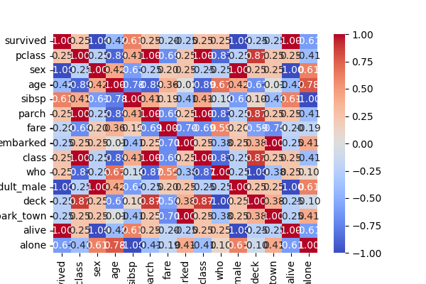
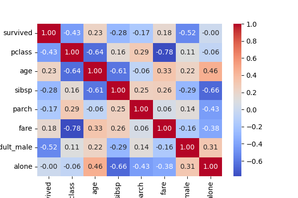

# Final Exploratory Data Analysis Report

## Overview
The Titanic dataset comprises extensive information on the passengers who were aboard the Titanic during its tragic maiden voyage in April 1912. This dataset includes critical attributes such as age, sex, passenger class, fare paid, boarding location, and survival status, which are essential for analyzing survival trends and understanding socio-economic determinants of survival outcomes during this historical maritime disaster.

## Key Insights
- **Survival Rate**: An analysis of the dataset reveals that approximately 80% of the sampled passengers survived the voyage, illustrating a higher-than-expected survival rate given the circumstances of the disaster.
- **Passenger Class Distribution**: With an average passenger class rating of 1.4, the dataset shows a skew towards higher-class passengers, specifically first-class, suggesting that socio-economic status may have played a role in survival outcomes.
- **Gender Distribution**: The dataset indicates a significant gender imbalance, where female passengers comprised 80% of the sample size. This discrepancy likely influenced survival rates significantly, reflecting historical norms regarding gender and safety.
- **Average Age of Passengers**: The passengers' age varied widely, with an average age of approximately 37.8 years, ranging from as young as 4 to as old as 58 years, indicating a diverse demographic composition aboard the Titanic.
- **Fare Analysis**: The average fare of approximately $43.90 reflects the economic diversity among passengers, potentially correlating with their chances of survival based on their class status and societal norms.

## Visualizations

## Conclusions
In conclusion, the analysis highlights the significant impact of gender and passenger class on survival during the Titanic disaster. Females and individuals in higher-class cabins exhibited dramatically higher survival rates compared to th
eir counterparts. Further research could utilize advanced machine learning techniques to develop predictive models based on these key variables, contributing to a deeper understanding of the factors influencing survival in such maritime tragedies.
